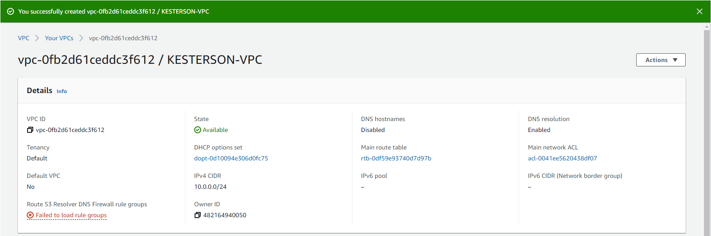
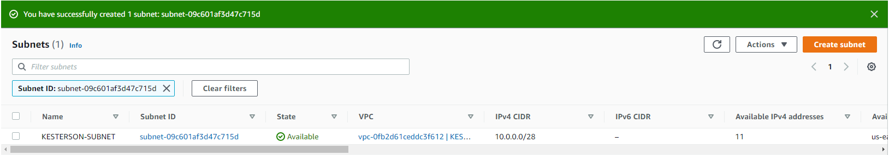
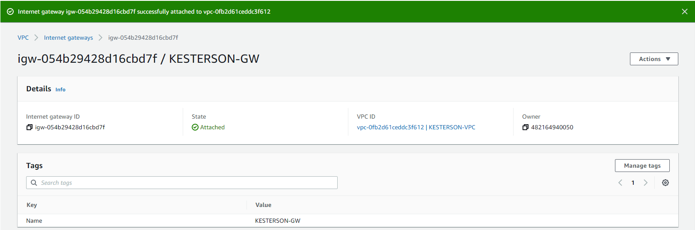
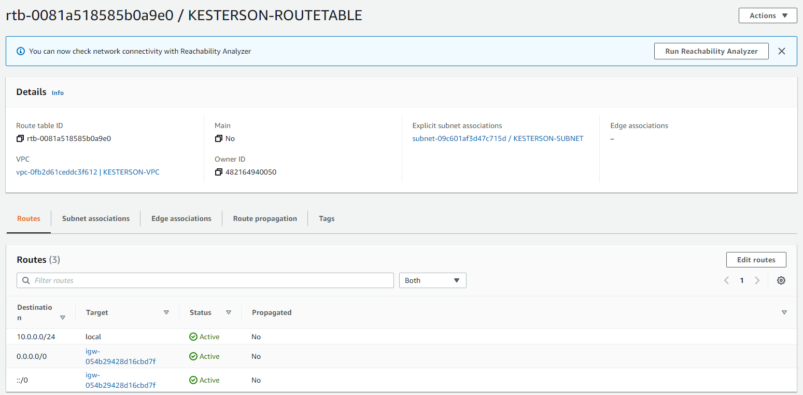
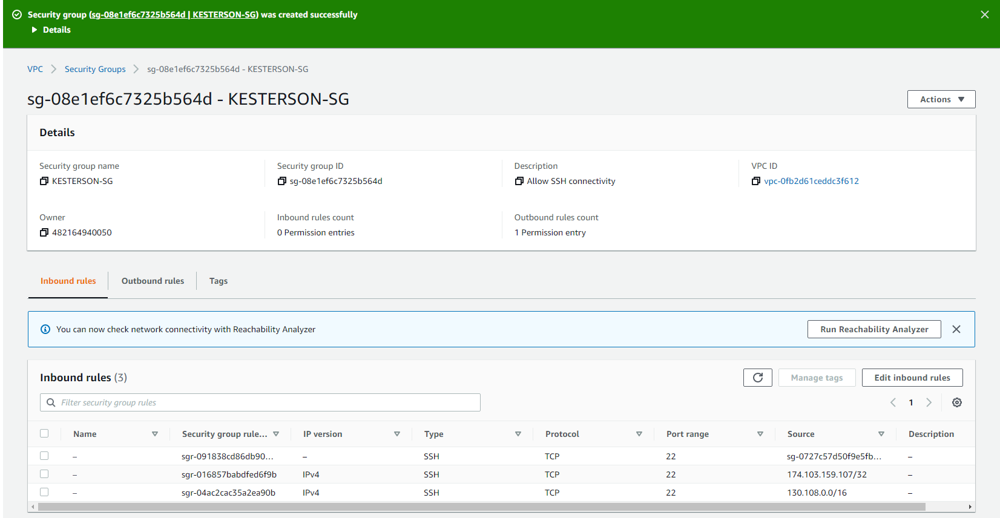
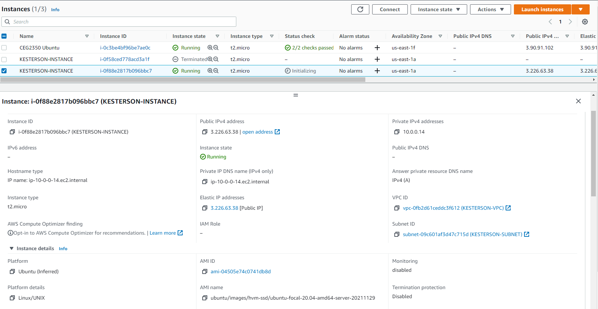
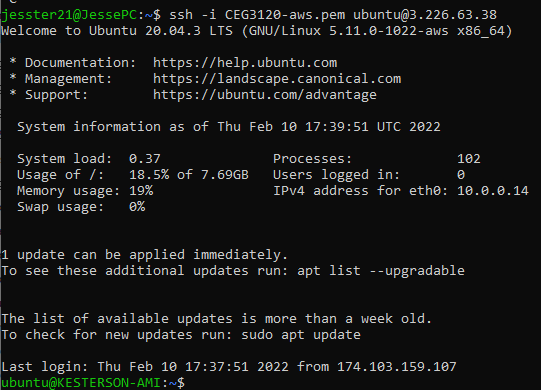

## Part 1 - Build a VPC

For each step below, provide a screenshot that shows the network resource has been created according to specification along with a description of what the resource does (what is its role). You may add whatever additional notes you would like. **The screenshot and description of each network component is required**. Any other notes you leave behind may make this project more useful in the future. Getting a good screenshot can be done by clicking on the resource and showing configurations in the details menu.

1. Create a VPC.
   - Tag it with "YOURLASTNAME-VPC"
   - Specify a /24 private IP address range
   - 
   - Went to VPC and created a new VPC with the name "KESTERSON-VPC" and the IPv4 CIDR of 10.0.0.0/24
2. Create a subnet
   - Tag it with "YOURLASTNAME-Subnet"
   - Specify a /28 private IP address range
   - Attach it to your VPC
   - 
   - I selected Subnet and then Create Subnet. Under VPC, I selected the VPC I just created. I used the subnet name of "KESTERSON-SUBNET" and made the IPv4 CIDR block of 10.0.0.0/28
3. Create an internet gateway
   - Tag it with "YOURLASTNAME-gw"
   - Attach it to your VPC
   - 
   - I clicked on Internet Gateway and then Create Internet Gateway. I used the name "KESTERSON-GW". There was an option that popped up that allowed me to attach it to the VPC I created.
4. Create a route table
   - Tag it with "YOURLASTNAME-routetable"
   - Attach it to your VPC
   - Associate it with your subnet
   - Add a routing table rule that sends traffic to all destinations to your internet gateway
   - 
   - I clicked on Route Tables and then on Create Route Table. I used the name "KESTERSON-ROUTETABLE" and slected the VPC I just created. To add my subnet, I clicked on Actions then Edit Subnet Associations. I clicked on my subnet and then saved it. For Routes, I clicked on Edit Routes. I added 10.0.0.0/24, 0.0.0.0/0, and ::/0.
5. Create a security group
   - Tag it with "YOURLASTNAME-sg"
   - Allow SSH for a set of trusted networks including:
     - Your home / where you usually connect to your instances from
     - Wright State (addresses starting with 130.108)
     - Instances within the VPC
   - Attach it to your VPC
   - Image should include your Inbound rules
   - 
   - For security groups, I had to go to EC2 and clicked on Create Security Group. I named it "KESTERSON-SG" and described it as "Allow SSH Connectivity". I added the three following rules:
        - SSH type with the VPC IP address
        - SSH type with the IP addresses of Wright State (130.108.0.0/16)
        - SSH type with the IP address of my Ubuntu machine using the command "curl ipinfo.io" that was provided (174.103.159.107/32)
6. (If necessary, else skip) Create a key pair

## Part 2 - EC2 instances

1. Create a new instance. Give a write up of the following information:
   - AMI selected
     - default username of the instance type selected
   - Instance type selected
        - I clicked on Instances then on Launch Instances. I chose the option "Ubuntu Server 20.04 LTS (HVM), SSD Volume Type 64-bit(x86).
2. Attach the instance to your VPC. As discussed there are different pathways to doing this. Say how you did it.
    - On Step 3: Configure Instance Details, I chose the VPC that I had previously created and it auto filled my subnet options for me.
3. Determine whether a Public IPv4 address will be auto-assigned to the instance. Justify your choice to do so (or not do so)
   - **NOTE** - in the next few steps, you will be required to request an Elastic IP address and associate it to the instance. Factor that in to your discussion here.
   - I kept the standard option of disabling Auto-assign Public IP. I created my own elastic IP address previously and was waiting to create this instace to assign this instance to that IP address. 
4. Attach a volume to your instance. As discussed there are different pathways to doing this. Say how you did it.
    - On the next slide, I used the standard 8GB General Purpose SSD.
5. Tag your instance with a "Name" of "YOURLASTNAME-instance". Say how you did it.
    - I clicked on add tag with the value of "KESTERSON-INSTANCE".
6. Associate your security group, "YOURLASTNAME-sg" to your instance. Say how you did it.
    - Under Assign A Security Group, I chose the option of "Select an existing security group". I was able to select the security group I had previously made.
7. Reserve an Elastic IP address. Tag it with "YOURLASTNAME-EIP". Associate the Elastic IP with your instance. Say how you did it.
    - Under the Elastic IPs tab, I selected Allocate Elastic IP address. At the bottom, hit the button Allocate. Next, you select the IP address you just created and click on Actions and then Associate Elastic IP Address. Once there, under Instance, I selected the instance I just created. 
8. Create a screenshot your instance details and add it to your project write up. Example below:
   - 
9. `ssh` in to your instance. Change the hostname to "YOURLASTNAME-AMI" where AMI is some version of the AMI you chose. Say how you did it.
    - I logged into my instance from my ubuntu machine using the command "ssh -i CEG3120-aws.pem ubuntu@3.226.63.38". Once inside, I used the command "sudo cp hostname hostname.old" to copy the old file just incase something went wrong. I then used the command "sudo nano /etc/hostname" to change my hostname to "KESTERSON-AMI". I then used the command "sudo reboot" to restart my instance and waited until it was restarted. I logged in again and saw my name changed to "ubuntu@KESTERSON-AMI".
10. Create a screenshot your ssh connection to your instance and add it to your project write up - make sure it shows your new hostname.
    - 
